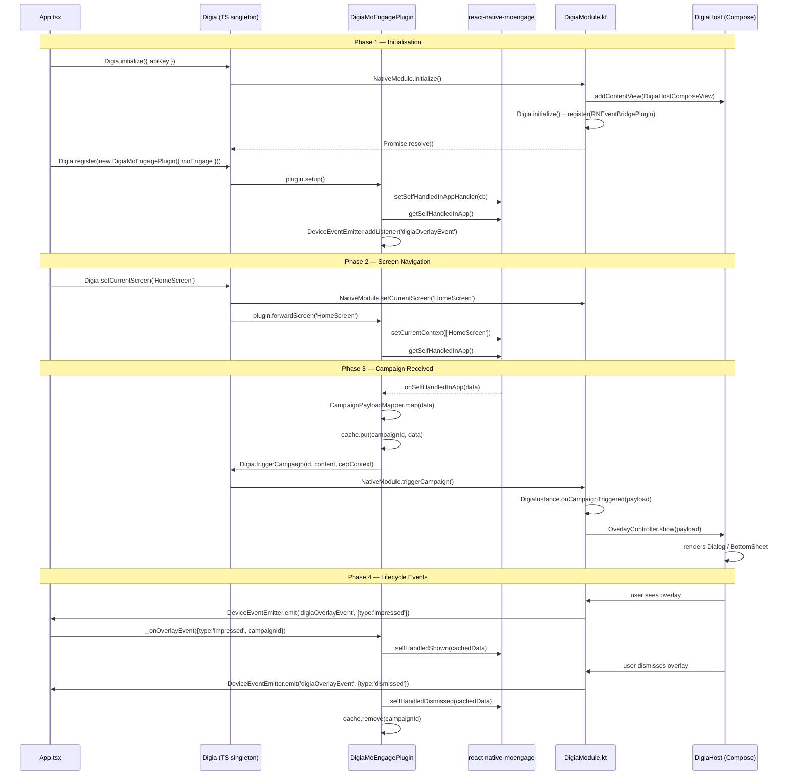

# Digia + MoEngage React Native Integration — Architecture & Developer Guide

## Table of Contents

1. [Overview](#overview)
2. [Package Structure](#package-structure)
3. [Architecture Layers](#architecture-layers)
4. [Complete Data Flow](#complete-data-flow)
5. [Phase-by-Phase Walkthrough](#phase-by-phase-walkthrough)
   - [Phase 1 — Initialisation](#phase-1--initialisation)
   - [Phase 2 — Screen Navigation](#phase-2--screen-navigation)
   - [Phase 3 — Campaign Received](#phase-3--campaign-received)
   - [Phase 4 — Lifecycle Events](#phase-4--lifecycle-events)
6. [Key Components Reference](#key-components-reference)
7. [Plugin System](#plugin-system)
8. [Android Native Bridge Deep Dive](#android-native-bridge-deep-dive)
9. [iOS Behaviour](#ios-behaviour)
10. [Quick Start](#quick-start)
11. [API Reference](#api-reference)

---

## Overview

This integration connects three layers:

| Layer | Technology | Responsibility |
|---|---|---|
| **JavaScript / TypeScript** | React Native | App logic, screen tracking, plugin coordination |
| **React Native Bridge** | Kotlin (Android) / ObjC stub (iOS) | Translates TS calls into native SDK calls |
| **Native SDK** | Jetpack Compose (Android) | Renders campaign overlays (Dialog / BottomSheet) on top of the RN UI |

The SDK surfaces two distinct UI modes driven by Digia CEP campaigns:

| Mode | Component | Sizing | Use Case |
|---|---|---|---|
| **In-App Nudge** | `<DigiaHostView>` | Full-screen overlay (separate Android `Window`) | Dialogs, bottom sheets — rendered above all RN content |
| **Inline** | `<DigiaSlotView placementKey="…">` | Sized by your JS `style` prop | Banners, cards — embedded inside scroll views or screen layouts |

A **plugin system** allows third-party CEP tools (e.g. MoEngage) to hook into Digia's lifecycle without modifying the core bridge. The `DigiaMoEngagePlugin` is a **pure TypeScript** plugin — it contains zero native code.

---

## Package Structure

```
@digia/engage-react-native          ← core bridge
│
├── src/
│   ├── Digia.ts                    ← public singleton (initialize, register, setCurrentScreen, …)
│   ├── types.ts                    ← DigiaConfig, DigiaPlugin, DigiaNavigationOptions
│   ├── NativeDigiaModule.ts        ← low-level TurboModule spec
│   └── DigiaHostView.tsx           ← <DigiaHostView> React component (Android: Compose host)
│
└── android/
    └── com/digia/engage/rn/
        ├── DigiaModule.kt          ← ReactContextBaseJavaModule
        ├── DigiaHostComposeView.kt ← AbstractComposeView mounting DigiaHost { }
        ├── DigiaViewManager.kt     ← SimpleViewManager<DigiaHostComposeView>
        ├── DigiaPackage.kt         ← ReactPackage
        └── RNEventBridgePlugin     ← inner class — DigiaCEPPlugin that emits DeviceEvents

@digia/moengage-react-native        ← pure TS MoEngage CEP plugin
│
└── src/
    ├── DigiaMoEngagePlugin.ts      ← implements DigiaPlugin
    ├── CampaignCache.ts            ← in-memory Map (campaignId → SelfHandledData)
    ├── CampaignPayloadMapper.ts    ← MoEngage data → Digia InAppPayload
    ├── MoEngageEventDispatcher.ts  ← routes overlay events → MoEngage analytics calls
    └── types.ts                    ← MoEngageCampaignData, InAppPayload, …
```

---

## Architecture Layers

```
┌─────────────────────────────────────────────────────────────────┐
│                      React Native (JS/TS)                       │
│                                                                 │
│  App.tsx ──► Digia.setCurrentScreen()                           │
│                    │                                            │
│             ┌──────▼──────────────────────┐                    │
│             │   Digia singleton           │                    │
│             │  ┌──────────────────────┐   │                    │
│             │  │ DigiaMoEngagePlugin  │   │                    │
│             │  │  (DigiaPlugin impl)  │   │                    │
│             │  └──────────────────────┘   │                    │
│             └──────┬──────────────────────┘                    │
│                    │ NativeModule calls                          │
│                                                                 │
│  <DigiaHostView />              <DigiaSlotView placementKey />  │
│  (full-screen overlay host)     (inline slot, JS-sized)         │
├────────────────────┬──────────────────────┬─────────────────────┤
│           Android Native Bridge (Kotlin)  │                     │
│                    │                      │                     │
│             DigiaModule.kt        DigiaSlotViewManager.kt       │
│              ├─ initialize()     DigiaSlotComposeView.kt        │
│              ├─ setCurrentScreen()  (placementKey prop)         │
│              ├─ triggerCampaign()                               │
│              └─ RNEventBridgePlugin → DeviceEventEmitter        │
│                    │                      │                     │
├────────────────────┼──────────────────────┼─────────────────────┤
│              Jetpack Compose (Android)    │                     │
│                    │                      │                     │
│   DigiaHostComposeView              DigiaSlotComposeView        │
│    └─ DigiaHost { }                  └─ DigiaSlot(key)          │
│        ├─ Dialog overlay                 └─ inline component    │
│        └─ BottomSheet overlay              (banner, card, …)    │
└─────────────────────────────────────────────────────────────────┘
```

---

## Complete Data Flow



---

## Phase-by-Phase Walkthrough

### Phase 1 — Initialisation

**Goal:** Boot the Digia native SDK, mount the Compose overlay host, wire up the MoEngage plugin.

#### Step 1.1 — Digia.initialize()

```ts
// App.tsx
await Digia.initialize({
  apiKey: 'YOUR_API_KEY',
  environment: 'production',
});
```

Internally (`Digia.ts`):
```ts
async initialize(config: DigiaConfig): Promise<void> {
  await NativeDigiaModule.initialize(config.apiKey, config.environment ?? 'production');
}
```

The call crosses the bridge into Kotlin (`DigiaModule.kt`):

```kotlin
@ReactMethod
fun initialize(apiKey: String, environment: String, promise: Promise) {
    val activity = currentActivity as? ReactActivity ?: return
    activity.runOnUiThread {
        // 1. Mount the Compose host view on top of the React Native view hierarchy
        mountDigiaHost(activity)
        // 2. Initialise the Digia Android SDK
        Digia.initialize(activity.applicationContext, DigiaConfig(apiKey, environment))
        // 3. Register the event bridge so overlay lifecycle events flow back to JS
        Digia.register(RNEventBridgePlugin(reactApplicationContext))
        promise.resolve(null)
    }
}
```

`mountDigiaHost` adds `DigiaHostComposeView` (an `AbstractComposeView`) via `addContentView()`. This view renders `DigiaHost { }` — the Jetpack Compose composable that manages Dialogs and BottomSheets. Crucially, the view has `onTouchEvent` returning `false` so it never intercepts React Native touches when no overlay is showing.

```kotlin
// DigiaHostComposeView.kt
override fun Content() {
    DigiaHost()   // Compose entry point managed by the Android SDK
}

override fun onTouchEvent(event: MotionEvent?): Boolean = false  // pass-through
```

#### Step 1.2 — Digia.register(plugin)

```ts
// src/digia.ts (sample app)
import { Digia } from '@digia/engage-react-native';
import { DigiaMoEngagePlugin } from '@digia/moengage-react-native';
import MoEngage from 'react-native-moengage';

export async function initDigia() {
  await Digia.initialize({ apiKey: 'YOUR_DIGIA_API_KEY' });
  Digia.register(new DigiaMoEngagePlugin({ moEngage: MoEngage }));
}
```

`Digia.register()` stores the plugin in an internal `Map<string, DigiaPlugin>` and then calls `plugin.setup()`:

```ts
// Digia.ts
register(plugin: DigiaPlugin): void {
  this._plugins.set(plugin.identifier, plugin);
  plugin.setup();   // @internal — called only by Digia itself
}
```

`DigiaMoEngagePlugin.setup()` wires three things:

```ts
// DigiaMoEngagePlugin.ts
setup(): void {
  // 1. Listen for self-handled in-app campaigns from MoEngage
  this._moEngage.setSelfHandledInAppHandler(this._onSelfHandledInApp);

  // 2. Request any pending campaign for the current screen
  this._moEngage.getSelfHandledInApp();

  // 3. Listen for Digia overlay events emitted by RNEventBridgePlugin (Kotlin)
  this._overlayEventSub = DeviceEventEmitter.addListener(
    'digiaOverlayEvent',
    this._onOverlayEvent,
  );
}
```

---

### Phase 2 — Screen Navigation

**Goal:** Every screen transition is forwarded to both the Digia native SDK and MoEngage, allowing campaigns to be targeted per screen.

```tsx
// App.tsx — NavigationContainer callback
const onNavigationStateChange = () => {
  const route = navRef.getCurrentRoute();
  if (route) {
    Digia.setCurrentScreen(route.name);
  }
};
```

`Digia.setCurrentScreen()` does three things atomically:

```ts
// Digia.ts
setCurrentScreen(name: string): void {
  // 1. Forward to native Android SDK
  NativeDigiaModule.setCurrentScreen(name);

  // 2. Forward to every registered plugin
  this._plugins.forEach(plugin => plugin.forwardScreen(name));
}
```

`DigiaMoEngagePlugin.forwardScreen()` uses the MoEngage screen context API:

```ts
// DigiaMoEngagePlugin.ts
forwardScreen(name: string): void {
  // Tell MoEngage which screen the user is on
  this._moEngage.setCurrentContext({ contexts: [name] });

  // Ask MoEngage for any pending campaign targeting this screen
  this._moEngage.getSelfHandledInApp();
}
```

After `getSelfHandledInApp()`, if MoEngage has a campaign targeting this screen, it calls `onSelfHandledInApp` — which begins Phase 3.

---

### Phase 3 — Campaign Received

**Goal:** Convert a MoEngage campaign payload into something Digia's Compose UI can render, then trigger the overlay.

#### Step 3.1 — Payload mapping

```ts
// DigiaMoEngagePlugin.ts
private _onSelfHandledInApp = (data: MoEngageSelfHandledData): void => {
  // Map the MoEngage payload structure → Digia InAppPayload
  const payload = mapCampaignPayload(data);
  const campaignId = data.data.campaign.campaignId;

  // Cache the raw MoEngage data — needed later for analytics callbacks
  this._cache.put(campaignId, data);

  // Hand the mapped payload to Digia for rendering
  Digia.triggerCampaign(
    campaignId,
    payload.content,      // DSL-compatible content (viewId, args, …)
    payload.cepContext,   // { campaignId, campaignName } for attribution
  );
};
```

`CampaignPayloadMapper` parses MoEngage's `campaign.payload` (a JSON string in the campaign dashboard) and merges it with campaign metadata:

```ts
// CampaignPayloadMapper.ts
export function mapCampaignPayload(data: MoEngageSelfHandledData): InAppPayload {
  const raw = data.data.campaign;
  const content = JSON.parse(raw.payload ?? '{}');
  return {
    content: {
      viewId: content.viewId,          // must match a view in your Digia DSL config
      args: content.args ?? {},
      ...content,
    },
    cepContext: {
      campaignId: raw.campaignId,
      campaignName: raw.campaignName,
    },
  };
}
```

#### Step 3.2 — Crossing the bridge

```ts
// Digia.ts
triggerCampaign(
  id: string,
  content: Record<string, unknown>,
  cepContext: Record<string, unknown>,
): void {
  NativeDigiaModule.triggerCampaign(id, content, cepContext);
}
```

On the Kotlin side (`DigiaModule.kt`):

```kotlin
@ReactMethod
fun triggerCampaign(
    campaignId: String,
    content: ReadableMap,
    cepContext: ReadableMap,
    promise: Promise,
) {
    val payload = RenderPayload(
        campaignId = campaignId,
        content = content.toHashMap(),
        cepContext = cepContext.toHashMap(),
    )
    DigiaInstance.onCampaignTriggered(payload)
    promise.resolve(null)
}
```

`DigiaInstance.onCampaignTriggered()` is the Android SDK's internal routing point. It passes the payload to `OverlayController`, which triggers the Compose rendering inside `DigiaHost { }`.

#### Step 3.3 — Compose renders the overlay

`DigiaHost { }` is a Compose composable that reads the payload's `viewId` to look up a registered UI component in the DSL config, then renders it as either a `Dialog` or `BottomSheet` using Android's window manager. Since Android Dialogs and BottomSheets create their own separate windows, they render on top of the React Native view hierarchy without any z-index management.

---

### Phase 4 — Lifecycle Events

**Goal:** Feed overlay impression, click, and dismiss signals back to MoEngage for analytics and attribution.

#### How events travel from Compose → TypeScript

`RNEventBridgePlugin` is an inner class in `DigiaModule.kt` that implements Digia's `DigiaCEPPlugin` interface. It is registered during `initialize()` and receives all overlay lifecycle callbacks:

```kotlin
// DigiaModule.kt (inner class)
inner class RNEventBridgePlugin(
    private val reactContext: ReactApplicationContext,
) : DigiaCEPPlugin {

    override fun onImpressed(payload: RenderPayload) =
        emit("impressed", payload.campaignId)

    override fun onClicked(payload: RenderPayload, elementId: String?) =
        emit("clicked", payload.campaignId, elementId)

    override fun onDismissed(payload: RenderPayload) =
        emit("dismissed", payload.campaignId)

    private fun emit(type: String, campaignId: String, elementId: String? = null) {
        val map = Arguments.createMap().apply {
            putString("type", type)
            putString("campaignId", campaignId)
            elementId?.let { putString("elementId", it) }
        }
        reactContext
            .getJSModule(DeviceEventManagerModule.RCTDeviceEventEmitter::class.java)
            .emit("digiaOverlayEvent", map)
    }
}
```

In TypeScript, `DigiaMoEngagePlugin._onOverlayEvent` listens on `DeviceEventEmitter` and dispatches to `MoEngageEventDispatcher`:

```ts
// DigiaMoEngagePlugin.ts
private _onOverlayEvent = (e: { type: string; campaignId: string; elementId?: string }): void => {
  const data = this._cache.get(e.campaignId);
  if (!data) return;  // campaign not tracked by this plugin

  const event: DigiaExperienceEvent =
    e.type === 'impressed'  ? { type: 'impressed' } :
    e.type === 'clicked'    ? { type: 'clicked', elementId: e.elementId } :
                              { type: 'dismissed' };

  MoEngageEventDispatcher.dispatch(event, data);
};
```

`MoEngageEventDispatcher` routes to the correct MoEngage analytics method:

```ts
// MoEngageEventDispatcher.ts
static dispatch(event: DigiaExperienceEvent, data: MoEngageSelfHandledData): void {
  switch (event.type) {
    case 'impressed':
      MoEngage.selfHandledShown(data);        // registers impression
      break;
    case 'clicked':
      MoEngage.selfHandledClicked(data, event.elementId); // registers click
      break;
    case 'dismissed':
      MoEngage.selfHandledDismissed(data);    // registers dismiss
      break;
    default:
      // TypeScript exhaustive check — never reached
      const _never: never = event;
  }
}
```

After a dismiss, the cache entry is removed to prevent stale analytics:

```ts
if (event.type === 'dismissed') {
  this._cache.remove(e.campaignId);
}
```

---

## Inline vs In-App Nudge — Side-by-Side

| Concern | In-App Nudge (`DigiaHostView`) | Inline (`DigiaSlotView`) |
|---|---|---|
| **Placement** | Single instance at app root | One per slot, anywhere in the tree |
| **Sizing** | Full-screen — SDK controls size | Your `style` prop controls width/height |
| **Rendering layer** | Separate Android `Window` — above all RN views | Embedded in the normal RN view hierarchy |
| **Campaign command** | `SHOW_DIALOG` / `SHOW_BOTTOM_SHEET` | `SHOW_INLINE` |
| **Dashboard key** | n/a | `placementKey` — matches dashboard slot key |
| **Appears when** | `DigiaInstance.routeNudge()` fires | `DigiaInstance.routeInline()` stores payload for key |
| **Cleared when** | User dismisses (or `invalidateCampaign`) | Server invalidates or user dismisses |

### How an inline campaign reaches `DigiaSlotView`

1. MoEngage delivers a self-handled campaign whose `payload` JSON includes `"command": "SHOW_INLINE"` and `"placementKey": "hero_banner"`.
2. `DigiaMoEngagePlugin` maps and forwards the payload to `Digia.triggerCampaign()` (same path as nudges).
3. `DigiaInstance.routeCampaign()` reads the `command` field and calls `DisplayCoordinator.routeInline(placementKey, payload)`, which stores it in `OverlayController.slotPayloads`.
4. Any mounted `DigiaSlotComposeView` whose `placementKey` matches recomposes automatically — the Compose `DigiaSlot(placementKey)` observes `slotPayloads` as a `StateFlow`.
5. The component identified by `componentId` in the payload is rendered inside the space allocated by the RN `style` prop.

```tsx
// The dashboard payload for an inline campaign:
{
  "command": "SHOW_INLINE",
  "placementKey": "hero_banner",
  "componentId": "promo_card",
  "args": { "title": "Flash Sale", "discount": "20%" }
}
```

---

## Key Components Reference

### `Digia` (TypeScript singleton)

| Method | Description |
|---|---|
| `initialize(config)` | Boots the native SDK, mounts the Compose host view |
| `register(plugin)` | Adds a `DigiaPlugin`, calls `plugin.setup()` |
| `unregister(pluginOrId)` | Removes a plugin, calls `plugin.teardown()` |
| `setCurrentScreen(name)` | Native tracking + forwards to all plugins |
| `openNavigation(options)` | Launches full-screen Digia navigation flow |
| `triggerCampaign(id, content, cepContext)` | Pushes campaign payload to native for rendering |
| `invalidateCampaign(campaignId)` | Cancels an in-flight campaign |

### `DigiaMoEngagePlugin`

| Method | Visibility | Description |
|---|---|---|
| `setup()` | `@internal` | Called by `Digia.register()` — wires handlers |
| `forwardScreen(name)` | `@internal` | Called by `Digia.setCurrentScreen()` |
| `teardown()` | `@internal` | Called by `Digia.unregister()` — removes listeners |
| `healthCheck()` | `public` | Returns `{ isHealthy, metadata }` |

### `CampaignCache`

In-memory `Map<campaignId, MoEngageSelfHandledData>`. Enables the plugin to look up the original MoEngage campaign object when a lifecycle event fires (since events only carry `campaignId`).

### `DigiaSlotView` (TypeScript component)

| Prop | Type | Description |
|---|---|---|
| `placementKey` | `string` | Dashboard slot key — must match `placementKey` in the campaign payload |
| `style` | `StyleProp<ViewStyle>` | Controls width and height of the allocated slot |

On Android, wraps `DigiaSlotComposeView` (an `AbstractComposeView` hosting `DigiaSlot(placementKey)`). On iOS, renders a transparent `<View>` placeholder.

### `DigiaSlotViewManager` (Kotlin, internal)

`SimpleViewManager<DigiaSlotComposeView>` registered as `"DigiaSlotView"`. Receives the `placementKey` prop via `@ReactProp` and updates the view's Compose `mutableStateOf` property, triggering an instant recomposition.

### `RNEventBridgePlugin` (Kotlin, internal)

Implements `DigiaCEPPlugin`. Registered automatically during `Digia.initialize()`. Converts all Compose overlay lifecycle callbacks (impressed / clicked / dismissed) into `DeviceEventEmitter` events readable by JavaScript.

---

## Plugin System

The `DigiaPlugin` interface is the extension point for any CEP tool:

```ts
interface DigiaPlugin {
  /** Unique identifier — used as Map key in Digia's plugin registry */
  readonly identifier: string;

  /** @internal — called by Digia.register() */
  setup(): void;

  /** @internal — called by Digia.setCurrentScreen() */
  forwardScreen(name: string): void;

  /** @internal — called by Digia.unregister() */
  teardown(): void;
}
```

Lifecycle contract:

```
Digia.register(plugin)
  └─► plugin.setup()            ← wires listeners, initialises state

Digia.setCurrentScreen(name)
  └─► plugin.forwardScreen(name) ← update CEP context, fetch campaigns

Digia.unregister(plugin)
  └─► plugin.teardown()         ← removes listeners, clears state
```

Users never call `setup()`, `forwardScreen()`, or `teardown()` directly. The `Digia` singleton manages the entire plugin lifecycle.

---

## Android Native Bridge Deep Dive

### AbstractComposeView mounting

One challenge with embedding Jetpack Compose in a React Native app is that `ReactActivity` is not a `ComponentActivity` — it does not automatically provide the `ViewTreeLifecycleOwner`, `ViewTreeViewModelStoreOwner`, and `ViewTreeSavedStateRegistryOwner` that Compose requires.

`DigiaModule.mountDigiaHost()` explicitly wires all three before adding the view:

```kotlin
private fun mountDigiaHost(activity: ReactActivity) {
    val view = DigiaHostComposeView(activity)
    view.setViewTreeLifecycleOwner(activity)
    view.setViewTreeViewModelStoreOwner(activity)
    view.setViewTreeSavedStateRegistryOwner(activity)
    val params = WindowManager.LayoutParams(MATCH_PARENT, MATCH_PARENT).apply {
        flags = FLAG_NOT_FOCUSABLE or FLAG_NOT_TOUCH_MODAL
    }
    activity.addContentView(view, params)
}
```

### Touch pass-through

When no overlay is showing, the `DigiaHostComposeView` covers the entire screen but must not intercept any touches. Compose Dialogs and BottomSheets create their own separate Android `Window` objects — they don't live inside `DigiaHostComposeView`'s layout. The host view simply acts as a Compose runtime anchor:

```kotlin
override fun onTouchEvent(event: MotionEvent?): Boolean = false  // never consume
```

---

## iOS Behaviour

The Digia overlay system is built on Jetpack Compose, which is an Android-only technology. iOS uses ART-independent rendering (Core Animation / UIKit) and cannot run Compose.

The iOS module (`DigiaEngageModule.m`) provides stub implementations for all methods:

```objc
RCT_EXPORT_METHOD(initialize:(NSString *)apiKey
                  environment:(NSString *)env
                  resolve:(RCTPromiseResolveBlock)resolve
                  reject:(RCTPromiseRejectBlock)reject) {
  resolve(nil);  // no-op — resolves immediately so app boot doesn't hang
}
```

This prevents "Native module not found" crashes in cross-platform RN apps. When Digia releases an iOS SDK, only this file needs to be replaced — no changes to the TypeScript layer are required.

---

## Quick Start

### 1. Install

```bash
npm install @digia/engage-react-native @digia/moengage-react-native react-native-moengage
```

### 2. Android `app/build.gradle`

Add the MoEngage SDK (required — `react-native-moengage` declares it `compileOnly`):

```groovy
dependencies {
    implementation("com.moengage:moe-android-sdk:13.00.01")
    implementation("com.moengage:inapp:8.1.0")
}
```

### 3. Bootstrap (`src/digia.ts`)

```ts
import { Digia } from '@digia/engage-react-native';
import { DigiaMoEngagePlugin } from '@digia/moengage-react-native';
import MoEngage from 'react-native-moengage';

export async function initDigia(): Promise<void> {
  await Digia.initialize({ apiKey: 'YOUR_DIGIA_API_KEY' });
  Digia.register(new DigiaMoEngagePlugin({ moEngage: MoEngage }));
}
```

### 4. Root component (`App.tsx`)

```tsx
export default function App() {
  const navRef = useNavigationContainerRef();

  useEffect(() => {
    MoEngage.initialize('YOUR_MOENGAGE_APP_ID');
    initDigia().catch(console.error);
  }, []);

  return (
    <NavigationContainer
      ref={navRef}
      onStateChange={() => {
        const route = navRef.getCurrentRoute();
        if (route) Digia.setCurrentScreen(route.name);
      }}>
      {/* DigiaHostView — full-screen Compose anchor for dialogs / bottom sheets */}
      <DigiaHostView style={StyleSheet.absoluteFillObject} />
      <Stack.Navigator>
        <Stack.Screen name="Home" component={HomeScreen} />
      </Stack.Navigator>
    </NavigationContainer>
  );
}
```

### 5. Add inline slots to screens

Place `<DigiaSlotView>` anywhere inside a screen component. Give it an explicit size so Compose has space to render:

```tsx
import { DigiaSlotView } from '@digia/engage-react-native';

export function HomeScreen() {
  return (
    <ScrollView>
      <ProductList />

      {/* Inline banner — sized explicitly */}
      <DigiaSlotView
        placementKey="home_hero_banner"
        style={{ width: '100%', height: 180 }}
      />

      <FeaturedProducts />

      {/* Mid-page slot */}
      <DigiaSlotView
        placementKey="home_mid_banner"
        style={{ width: '100%', height: 120 }}
      />
    </ScrollView>
  );
}
```

When no campaign is active for a `placementKey`, the Compose `DigiaSlot` renders nothing inside the allocated space.

### 6. MoEngage campaign setup

In the MoEngage dashboard, create a **Self-Handled In-App** campaign and set the campaign `payload` JSON to:

```json
{
  "viewId": "promo_dialog",
  "args": {
    "title": "Special Offer",
    "body": "Tap to claim your discount"
  }
}
```

`viewId` must match a view registered in your Digia DSL config.

---

## API Reference

### `@digia/engage-react-native`

#### `DigiaConfig`

```ts
interface DigiaConfig {
  apiKey: string;
  environment?: 'production' | 'staging' | 'development';
}
```

#### `DigiaPlugin`

```ts
interface DigiaPlugin {
  readonly identifier: string;
  /** @internal */ setup(): void;
  /** @internal */ forwardScreen(name: string): void;
  /** @internal */ teardown(): void;
}
```

#### `DigiaNavigationOptions`

```ts
interface DigiaNavigationOptions {
  startPageId?: string;
  params?: Record<string, unknown>;
}
```

#### `DigiaSlotView` props

```ts
interface DigiaSlotViewProps {
  /** Matches the placement key in the Digia dashboard and the SHOW_INLINE campaign payload */
  placementKey: string;
  /** Controls the width and height of the allocated slot space */
  style?: StyleProp<ViewStyle>;
}
```

---

### `@digia/moengage-react-native`

#### `DigiaMoEngagePluginOptions`

```ts
interface DigiaMoEngagePluginOptions {
  moEngage: MoEngageInstance;       // the react-native-moengage default export
  cache?: ICampaignCache;           // optional — override with your own cache impl
}
```

#### `ICampaignCache`

```ts
interface ICampaignCache {
  put(campaignId: string, data: MoEngageSelfHandledData): void;
  get(campaignId: string): MoEngageSelfHandledData | undefined;
  remove(campaignId: string): void;
  clear(): void;
  count(): number;
  campaignIds(): string[];
}
```

#### `InAppPayload`

```ts
interface InAppPayload {
  content: {
    viewId: string;
    args?: Record<string, unknown>;
    [key: string]: unknown;
  };
  cepContext: {
    campaignId: string;
    campaignName: string;
  };
}
```

#### `DigiaExperienceEvent`

```ts
type DigiaExperienceEvent =
  | { type: 'impressed' }
  | { type: 'clicked'; elementId?: string }
  | { type: 'dismissed' };
```

---

*Generated for Digia Engage React Native SDK — March 2026*
